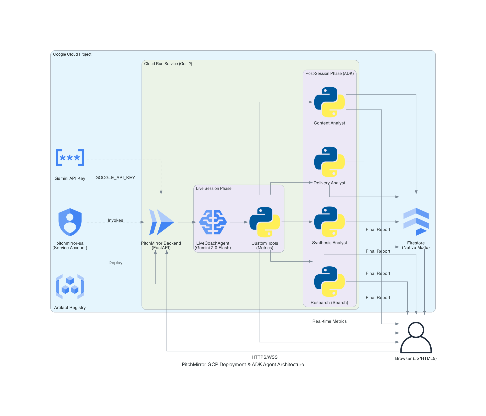

# PitchMirror

> Real-time AI speaking coach. Rehearse talks, interviews, demos, or pitches while PitchMirror listens, watches, and interrupts with measured feedback.

**Category:** Live Agents — [Gemini Live Agent Challenge](https://geminiliveagentchallenge.devpost.com/)

[](docs/architecture.png)

> Detailed view: [docs/architecture_detailed.png](docs/architecture_detailed.png)

---

## What it does

PitchMirror uses the **Gemini Live API** to simultaneously watch your webcam, listen to your microphone, and optionally analyze your shared screen while you speak.
You can also upload a slide deck PDF (from PowerPoint/Canva/Keynote export) so the coach can critique actual slide visuals in real time.
Before each run it captures a short intake:
- coach persona (`Professional Coach`, `Brutal VC`, `Supportive Mentor`)
- what you are preparing for
- delivery context (`virtual`, `in_person`, `hybrid`)
- primary goal (`balanced`, fillers, pacing, confidence, structure)

When it detects:

| Problem | Trigger | Example coaching response |
|---------|---------|--------------------------|
| Filler words | 3+ "um/uh/like" in 30s | *"Three 'ums' in ten seconds. Pause instead."* |
| Pace | `wpm_20s > 180` (rolling 20s window) | *"Slow down — you're rushing."* |
| Eye contact | Prolonged disengaged gaze (context-aware threshold) | *"Reconnect with the audience/camera."* |
| Contradiction | Statement contradicts prior claim | *"That contradicts your 'first to market' claim."* |
| Clarity | Incomprehensible sentence | *"That sentence lost everyone. Say it in one clause."* |
| Slide clarity (optional screen share) | clutter/unreadable/weak hierarchy | *"Slide is text-dense. Cut to three bullets."* |
| Slide-speech mismatch (optional) | narration and slide conflict | *"Narration and slide are misaligned."* |

During the live session, the coach can trigger real UI actions (`navigate_practice_slides`, `jump_to_slide`, `mark_slide_issue`) and generate an in-session visual hint (`generate_live_visual_hint`).

After your session: a **scorecard** with per-category scores, timeline events, AI report, citations, and up to 2 generated visual coaching cards.

Eye-contact handling is context-aware:
- `virtual`: camera-facing is prioritized.
- `in_person`: natural audience scanning is not penalized.
- `hybrid`: balanced room scanning plus periodic camera reconnection.

---

## Architecture

### Live Session (real-time)

One low-latency bidirectional stream, one orchestrating agent — intentionally lean for
sub-second response latency. Deep specialization moves to the post-session pipeline.

```
Browser (HTML/JS)
  ├── getUserMedia()  → webcam + mic
  ├── getDisplayMedia() (optional) → screen share
  ├── PCM 16kHz audio → WebSocket → Cloud Run
  ├── Webcam JPEG @1fps  → WebSocket → Cloud Run
  ├── Screen JPEG @0.5fps → WebSocket → Cloud Run
  └── Coach audio 24kHz ← WebSocket ← Cloud Run
            │
    ┌───────▼──────────────────────────────────────┐
    │  Cloud Run (FastAPI + Uvicorn)                │
    │                                               │
    │  LiveCoachAgent  (gemini-2.5-flash-native-    │
    │    -audio-preview-12-2025)                    │
    │    └── 10 ADK tools (closures over SessionState):
    │         flag_issue · check_eye_contact        │
    │         get_speech_metrics · draw_overlay     │
    │         navigate_practice_slides              │
    │         jump_to_slide · mark_slide_issue      │
    │         generate_live_visual_hint (Imagen)    │
    │         get_recent_transcript · adjust_focus  │
    └───────┬──────────────────────────────────────┘
            │
    ┌───────▼────────────┐   ┌──────────────────────┐
    │  Gemini Live API   │   │  Firestore            │
    │  (native audio)    │   │  Session scorecards   │
    └────────────────────┘   │  User skill profiles  │
                             └──────────────────────┘
```

> ADK supports multi-agent `run_live()` topologies via `sub_agents` and live transfers.
> PitchMirror keeps the live phase as a single orchestrating agent by design — the tool
> pipeline provides deterministic measurement grounding and Imagen image generation
> without the latency cost of mid-session agent handoffs.

### Post-Session Pipeline (multi-agent)

```
_run_post_session()
  │
  ├─ PARALLEL_ANALYSTS (ADK ParallelAgent)
  │    ├── DeliveryAnalyst  (gemini-2.5-flash)  → delivery_analysis
  │    ├── ContentAnalyst   (gemini-2.5-flash)  → content_analysis
  │    └── ResearchAgent    (google_search)     → research_tips
  │
  ├─ SynthesisAgent (gemini-2.5-flash)
  │    └── Combines all three → final report + SCORE_* lines + IMAGE_PROMPTS
  │
  └─ SessionSummaryAgent (gemini-2.5-flash)
       └── Writes structured JSON skill profile → Firestore
            (cross-session learning loop — feeds next session's context)

POST_SESSION_PIPELINE = SequentialAgent(
  PARALLEL_ANALYSTS → SynthesisAgent → SessionSummaryAgent
)
```

**Google Cloud services used:**
- Cloud Run (backend hosting)
- Firestore (session persistence)
- Secret Manager (API key management)
- Artifact Registry (container images)

---

## Prerequisites

- Python 3.12+
- A [Gemini API key](https://aistudio.google.com/app/apikey) with access to `gemini-2.5-flash-native-audio-preview-12-2025`
- Docker (for deployment)
- `gcloud` CLI + `terraform` (for cloud deployment)

---

## Local development (6 steps)

```bash
# 1. Clone and enter the repo
git clone https://github.com/SmartGridsML/GeminiLiveAgentHack.git
cd GeminiLiveAgentHack

# 2. Create virtual environment and install deps
python -m venv .venv
source .venv/bin/activate        # Windows: .venv\Scripts\activate
pip install -r requirements.txt

# 3. Set your API key
cp .env.example .env
# Edit .env and set GOOGLE_API_KEY=your_key_here

# 4. Run the smoke test (validates Live API access before building)
python scripts/smoke_test.py

# 5. Run tests
python -m pytest tests/ -v

# 6. Start the server
uvicorn backend.main:app --host 0.0.0.0 --port 8080 --reload
# Open: http://localhost:8080
```

---

## Reproducible testing (judge checklist)

Use this exact sequence to validate the project end-to-end in ~10 minutes.

### A) Backend health + model access

```bash
# 1) Health check (must return {"status":"ok"...})
curl -s http://localhost:8080/health

# 2) Gemini connectivity smoke test (must print success, no traceback)
python scripts/smoke_test.py

# 3) Unit tests
python -m pytest tests/ -v
```

Expected result:
- `/health` returns JSON with `"status": "ok"`.
- `smoke_test.py` completes without errors.
- `pytest` passes (current baseline: 25 tests).

### B) UI + live agent behavior

1. Open `http://localhost:8080/app`.
2. Session intake:
   - Mode: `presentation`
   - Delivery context: `virtual`
   - Toggle `Screen-aware coaching` ON (optional)
   - Toggle `Deterministic demo mode` ON
3. Click `Start Session`.
4. Speak this planted test script:

```text
So basically um, today I want to share our onboarding approach.
[LOOK DOWN at notes for 6+ seconds]
Our process is kind of sort of basically simple and literally works for everyone.
[SPEAK VERY FAST for ~10 seconds]
```

Expected result:
- Live interruptions appear in transcript and audio.
- ADK tool-call lines appear (for metrics and flags).
- Evidence chips show threshold/metric context on `flag_issue`.

### C) Post-session output

1. Click `End Session`.
2. Wait for pipeline steps to complete.

Expected result:
- Scorecard appears with category scores.
- `AI Coaching Report` section renders.
- `Evidence-Based Techniques` section renders.
- `Multimodal Visuals` section renders up to 2 generated cards (or fallback cards if image generation is unavailable).

### D) Optional API verification

```bash
# Recent sessions summary
curl -s http://localhost:8080/api/sessions?limit=3

# Session aggregates
curl -s http://localhost:8080/api/sessions/stats?limit=10
```

If `API_BEARER_TOKEN` is set, include auth headers:

```bash
curl -s -H "Authorization: Bearer $API_BEARER_TOKEN" http://localhost:8080/api/sessions?limit=3
```

Expected result:
- Both endpoints return valid JSON.
- Latest session appears in `/api/sessions`.

---

## Cloud Run deployment

### Option A: Manual (gcloud)

```bash
# Set your project
export PROJECT_ID=your-project-id
export REGION=us-central1
export REPO=pitchmirror
export GOOGLE_API_KEY=your_gemini_api_key
export API_BEARER_TOKEN=$(openssl rand -hex 24)

# Enable APIs (build + deploy + data + secrets)
gcloud services enable run.googleapis.com firestore.googleapis.com \
  secretmanager.googleapis.com artifactregistry.googleapis.com cloudbuild.googleapis.com \
  --project=$PROJECT_ID

# Create Artifact Registry repo (one-time)
gcloud artifacts repositories create $REPO \
  --repository-format=docker --location=$REGION --project=$PROJECT_ID

# Build + push current commit image with immutable digest
export SHA=$(git rev-parse --short HEAD)
export IMAGE_TAG=$REGION-docker.pkg.dev/$PROJECT_ID/$REPO/app:$SHA
gcloud builds submit . --tag $IMAGE_TAG --project=$PROJECT_ID
export DIGEST=$(gcloud artifacts docker images describe $IMAGE_TAG --project=$PROJECT_ID --format='value(image_summary.digest)')
export IMAGE_IMMUTABLE=$REGION-docker.pkg.dev/$PROJECT_ID/$REPO/app@$DIGEST

# Store API key in Secret Manager (create secret once, then add a version)
if ! gcloud secrets describe pitchmirror-gemini-api-key --project=$PROJECT_ID >/dev/null 2>&1; then
  gcloud secrets create pitchmirror-gemini-api-key \
    --replication-policy=automatic --project=$PROJECT_ID
fi
printf '%s' "$GOOGLE_API_KEY" | gcloud secrets versions add pitchmirror-gemini-api-key \
  --data-file=- --project=$PROJECT_ID

# Deploy to Cloud Run
gcloud run deploy pitchmirror \
  --image=$IMAGE_IMMUTABLE \
  --region=$REGION \
  --set-env-vars=GOOGLE_CLOUD_PROJECT=$PROJECT_ID,CORS_ALLOWED_ORIGINS=https://your-frontend-domain,API_BEARER_TOKEN=$API_BEARER_TOKEN,ENABLE_SCREEN_SHARE=true,ENABLE_IMAGE_GENERATION=true,DEMO_MODE_DEFAULT=false \
  --set-secrets=GOOGLE_API_KEY=pitchmirror-gemini-api-key:latest \
  --session-affinity \
  --min-instances=1 \
  --timeout=900 \
  --allow-unauthenticated \
  --project=$PROJECT_ID
```

### Option B: Terraform (IaC — recommended)

```bash
# ADC login for Terraform/provider auth
gcloud auth application-default login

# Optional explicit path (use $HOME, not "~")
export GOOGLE_APPLICATION_CREDENTIALS="$HOME/.config/gcloud/application_default_credentials.json"

# Avoid leaking values into shell history by using TF_VAR_*
export TF_VAR_project_id=$PROJECT_ID
# Prefer immutable digest from Option A build step (IMAGE_IMMUTABLE)
export TF_VAR_container_image=$IMAGE_IMMUTABLE
export TF_VAR_gemini_secret_id=pitchmirror-gemini-api-key
export TF_VAR_firestore_collection=pitchmirror_sessions
export TF_VAR_allowed_origins=https://your-frontend-domain
export TF_VAR_api_bearer_token=$(openssl rand -hex 24)
export TF_VAR_allow_unauthenticated=false
export TF_VAR_enable_screen_share=true
export TF_VAR_enable_image_generation=true
export TF_VAR_demo_mode_default=false
export TF_VAR_image_generation_timeout_s=24
export TF_VAR_image_generation_retries=1
export TF_VAR_image_model=imagen-4.0-fast-generate-001
# For public demo links, set true intentionally and keep API_BEARER_TOKEN enabled.

cd infra
terraform init
terraform apply

# Firestore composite index creation can take a few minutes on first deploy.
# Check output: firestore_user_history_index
```

---


Live deployed backend URL (include in project description):

- `https://pitchmirror-101569338664.us-central1.run.app`

---

## License

MIT
